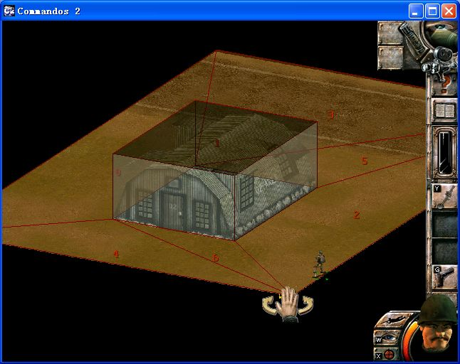
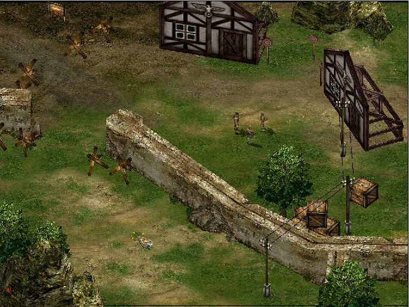

# CommDevToolkit - 盟军敢死队开发工具箱

## 简介

本工具箱主要用于盟军敢死队2和盟军敢死队3的修改。

使用说明请查看[Src\Doc\Readme.zh.txt](Src/Doc/Readme.zh.txt)。

如果希望进行本地化，请查看[Src\Doc\Localization.en.txt](Src/Doc/Localization.en.txt)。

如果希望了解本项目的结构，请查看[Src\Doc\Architecture.zh.txt](Src/Doc/Architecture.zh.txt)。

## 版权

本软件是免费自由软件，所有源代码和可执行程序按照三条款BSD许可证授权，详见[Src\Doc\License.zh.txt](Src/Doc/License.zh.txt)。

本软件的所有文档不按照BSD许可证授权，你可以不经修改的复制、传播这些文档，你还可以引用、翻译这些文档，其他一切权利保留。

Comm_开头的目录下的代码由NeoRAGEx2002授权发布，按照三条款BSD许可证授权，详见[Src\Doc\License-NeoRAGEx2002.txt](Src/Doc/License-NeoRAGEx2002.txt)。

本软件附带的zlib.net版权属于ComponentAce。

本软件附带的lzo.net版权属于Bianco Veigel。

本软件附带的Math.Net Numerics版权属于Math.Net。

本软件附带的文档obj_format.en.txt和mtl.en.txt的版权属于Wavefront, Inc。

## 相关网站和项目

[herbert3000](https://sites.google.com/site/commandosmod/)

[AbiBmpReplacer](https://github.com/subabrain/AbiBmpReplacer)

[Revora subforum](https://forums.revora.net/forum/2302-commandos-hq/)

# CommDevToolkit - Commandos Developing Toolkit

## Overview

The toolkit is mainly used in modification in Comm2 or Comm3.

For usage, see [Src\Doc\Readme.en.txt](Src/Doc/Readme.en.txt).

If you want to localize the software, see [Src\Doc\Localization.en.txt](Src/Doc/Localization.en.txt).

If you want to know about the architecture of this project, see [Src\Doc\Architecture.zh.txt](Src/Doc/Architecture.zh.txt).

## Copyright

The software is freeware without charge. All source codes and binary codes are licensed under the 3-clause BSD license, see [Src\Doc\License.en.txt](Src/Doc/License.en.txt).

All the documents are not under the same license. You can copy and distribute these documents without any modification. You can also refer and/or translate these documents. All other copyrights reserved.

Code under all directories beginning with Comm_ is published under 3-clause BSD license with the authorization of NeoRAGEx2002, see [Src\Doc\License-NeoRAGEx2002.txt](Src/Doc/License-NeoRAGEx2002.txt).

The copyright of the library zlib.net shipped with the software is held by ComponentAce.

The copyright of the library lzo.net shipped with the software is held by Bianco Veigel.

The copyright of the library Math.Net Numerics shipped with the software is held by Math.Net.

The copyright of the documents obj_format.en.txt and mtl.en.txt are held by Wavefront, Inc.

## Related Sites and Projects

[herbert3000](https://sites.google.com/site/commandosmod/)

[AbiBmpReplacer](https://github.com/subabrain/AbiBmpReplacer)

[Revora subforum](https://forums.revora.net/forum/2302-commandos-hq/)
