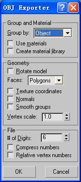

# Procedures to import and export OBJ

by NeoRAGEx2002, F.R.C.

## How to convert MBI to OBJ

\(a\) Convert with

NeoRAGEx2002's Comm_MBI3D

1\. Load a MBI file with Comm_MBI3D

2\. Press e to export OBJ, MTL and all textures

3\. OBJ, MTL will be placed in the same directory of MBI, and all the textures will be placed in the maps sub-directory

\(b\) Convert with ImageConverter.exe

Just drag MBI onto ImageConverter.exe.

## How to import OBJ to 3DS Max 8.0

1. In 3DS Max, add the directory where the textures are located to "User Paths": Menu-\>Customize-\>Configure User Paths-\>External Files-\>Add-\>OK. Notice: If the texture directory is not correctly configured, 3DS Max will popup "Textures not found. Can't display textures correctly" in following steps.

2. Afterwards, in 3DS Max, Menu-\>Import, Choose “Wavefront Object File” for file type, Select the desired obj file, configure as the following picture, OK**. Notice: the "Normals" must be checked, otherwise there will be something wrong with the face culling.**

3. After the model is loaded, Menu-\>Save as, Save as a Max file. **Notice: This step is required, otherwise textures may not be able to be displayed in the perspective window. (Thus, Step 5 may be invalid.****)**

4. Examine the model and ensure that the back face culling is correct. If not, select all, then Menu-\>Edit-\>Object Properties-\>Check "Backface cull", OK

5. After save, Menu-\>View-\>Activate All Maps, and the whole model is displayed in the perspective window

6. Then, adjust ambient light: In 3DS Max, Press m Key to open the material editor, Menu-\>Options-\>Options-\>Ambient Light-\>Set to pure white, OK. **Notice: This step is preferred. Otherwise, much of the textures displayed will be too dark.**

7. If the model imported is from Comm3, then alpha textures must be adjusted: First, Material Editor-\>Pick from Object-\>Pick the polygons to adjust (polygons which use the alpha textures)-\>Maps-\>Check "Opacity"-\>Pick a non-transparent texture, which has the same name as the diffuse texture-\>OK; Then adjust **Opacity Texture** options, Bitmap Parameters-\>**Mono Channel Output****-\>Alpha**; At last, click "Show Map in Viewport" icon or "Activate All Maps" in the main menu.

8. For alpha texture that emulate light, the procedures are completely the same as step 7

9. Close material editor, Menu-\>Views-\>Redraw All Views, OK. The end.

A conclusion for things that shall be noticed:

"Normals" shall be checked, backface cull shall be enabled, otherwise there will be something wrong with the backface culling

After imported OBJ, Save to MAX is required

Activate All Maps, then textures will show up

Adjust ambient light to brightest

For Comm3 model, Opacity map needs adjusting in some cases

## How to import OBJ to Polytrans 4.2.1

1. The procedure to convert MBI to OBJ is the same as the previous section

2. Open Polytrans 4.2.1, Menu-\>Edit-\>Preference-\>Config File Search paths and default directories-\>Bitmap path-\>Add, configure in the directory where the textures are located.

3. Menu-\>Translate!-\>Import 3D Geometry-\>Wavefront .obj files, Choose the obj file to import

4. Configure as follows

5. Click OK

## How to export OBJ from 3DS Max 8.0 for MBI

1. In 3DS Max, Menu-\>Export, Choose “Wavefront Object File” for file type, Type in the name for the .obj file, and then configure as follows:

2. Textures must be gifs. No space(" ") is allowed.

3. Files should be arranged as follows:

\<Name\>.mbi.files\\

\<Name\>.obj

\<MTL Name\>.mtl

\<Texture 1\>.gif

\<Texture 2\>.gif

……

4. Drag the directory onto ImageConverter.exe to generate a MBI file.

5\. The MBI format restricts the number of vertices and textures.

Maximum number of vertices is 32768;

Maximum number of textures is 256.

6\. From our test recently(2008.06), the MBI has following facts under the Commandos 2 engine:

Size of textures has to be 128\*128 or 256\*256, otherwise, the MBI will not be displayed.

7\. When there are too much objects, the scene in game may turns to be black screen (MBI load failure). We can try merging all objects into a single huge object.

## How to export OBJ from 3DS Max 8.0 for SEC

1. In 3DS Max, Menu-\>Export, Choose “Wavefront Object File” for file type, Type in the name for the .obj file, and then configure as follows:

2. Files should be arranged as follows:

\<Name\>.sec.files\\

\<Name\>.obj

3. Drag the directory onto ImageConverter.exe to generate a SEC file.

Notice:

In SEC modeling, you should use "extrude" to get the skin of the terrain.

The data representation in SEC differs from that in MBI. Every polygon in SEC can be seen as prism standing out of the ground, of which the ceil face is the polygon itself, the side faces is right-angled trapeziums, and the floor face is the orthographic projection of the polygon. Divide the borders into three classes: ceil borders, floor borders, and side borders. The side borders refer to all borders minus the borders of the ceil face and the borders of the floor face.

You must assure that ceil borders are not vertical against the ground (x!=0 or y!=0), floor borders are on the ground (x=0), side borders are vertical against the ground (x=y=0).

All side faces are vertical against the ground, and is not required to be draw out explicitly. But it's ok to draw them out. Anyway, the vertex pairs of the side faces (points that x, y are equal), must exist.

That is to say, a polygon standing out convex, must have the concave empty on the projection on the ground. And, for two neighboring polygons, they must be divided in the following right way.

And last, all polygon must be convex.

