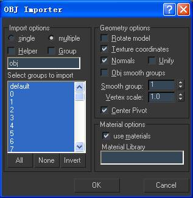
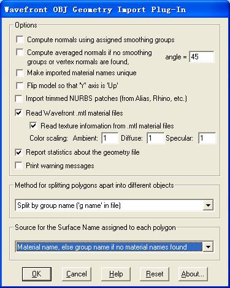
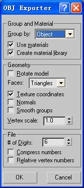
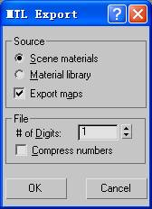
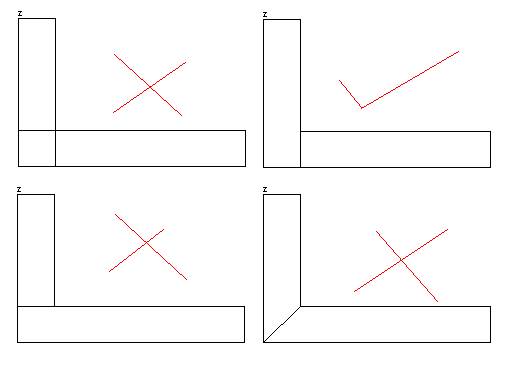

# OBJ导入导出步骤

NeoRAGEx2002，地狱门神（F.R.C.）制作整理

## 如何将MBI文件导出为OBJ文件

\(a\) 使用NeoRAGEx2002的Comm_MBI3D

1．使用Comm_MBI3D，加载一个MBI文件

2．按e键，导出OBJ、MTL和所有贴图

3．OBJ、MTL均将位于MBI文件的同一目录下，而所有导出贴图均将位于MBI文件所在目录中的maps子目录下

\(b\) 使用ImageConverter.exe

直接将MBI拖到ImageConverter.exe上即可。

## 如何将OBJ文件导入3DS Max 8.0

1．进入3DS Max，将贴图所在目录配置进“用户路径”：菜单-\>自定义-\>配置用户路径-\>外部文件-\>添加路径-\>确定，注意，如果这里不配置贴图路径的话，3DS Max将在导入中提示“贴图文件找不到，无法正常显示贴图”

2．然后，3DS Max中，菜单-\>导入，文件类型设置为“Wavefront Object文件”，选取导出的.obj文件，按照如下配置，确定。**注意，必须勾选上“法线”，否则在3DS Max导入之后背面拣选出错**

3．等模型加载完毕之后，菜单-\>另存为，保存为一个.Max文件，**注意，这里必须另存为一个.Max文件，否则将有可能无法在透视视口中显示贴图(即，第5步操作可能无效)**

4．大致查看一下模型，检查其背面消隐是否正常，如果不正常的话，全选所有对象，然后菜单-\>编辑-\>对象属性-\>显示属性-\>勾选“背面消隐”，确定即可

5．保存完毕之后，菜单-\>视图-\>激活所有贴图，便可以在透视视口中看到完整的模型了

6．然后，调整环境灯光亮度，在3DS Max中，按m键，进入材质编辑器，菜单-\>选项-\>选项-\>背景灯光-\>设置为纯白色，确定；**注意，这里必须将背景灯光调至最亮，否则，视口中的贴图将普遍偏暗**

7．如果导入的是盟3的模型，则必须调整一下透明贴图：首先，材质编辑器-\>从对象拾取材质-\>选取需要调整面(即透明贴图所在的面)-\>贴图-\>勾选”不透明度”-\>选择一个不透明度贴图，其贴图名称与漫反射贴图一致-\>确定；然后进一步调整**不透明度贴图**设置，位图参数-\>**单通道输出-\>Alpha**；最后，按下“在视口中显示贴图”图标或者在菜单中“激活所有贴图”即可

8．对于盟3中模仿光线效果的Alpha贴图，其调整方法与第7步中的步骤完全一致

9．关闭材质编辑器，3DS Max中，菜单-\>视图-\>重画所有视图，确定，导入工作完成

总结一下注意事项：

导入时要选取法线，背面消隐要打开，否则背面拣选不对

自OBJ导入后，必须另存为.MAX格式

激活所有贴图，方可看到贴图

在材质编辑器中将背景灯光调至最亮

对于盟3的模型，有可能需要调整一下不透明度贴图

## 如何将OBJ文件导入Polytrans 4.2.1

1．将.MBI导出成.OBJ的方法与上文相同

2．进入Polytrans 4.2.1，菜单-\>Edit-\>Preference-\>Config File Search paths and default directories-\>Bitmap path-\>Add，将导出贴图所在的目录配置进去

3．菜单-\>Translate!-\>Import 3D Geometry-\>Wavefront .obj files，选择需要导入的.obj文件

4．按照下图设置导入选项

5．确定即可，导入完毕！

## 如何从3DS Max 8.0导出OBJ文件用于生成MBI文件

1．3DS Max中，菜单-\>导出，文件类型设置为“Wavefront Object文件”，选取导出的.obj文件，按照如下配置，确定。

2．贴图必须使用gif格式，贴图文件名称中不要有空格。

3．按如下形式放置文件：

   \<名称\>.mbi.files\\

\<名称\>.obj

\<MTL名称\>.mtl

\<贴图1\>.gif

\<贴图2\>.gif

……

4．将文件夹拖到ImageConverter.exe上，生成MBI文件。

5．MBI格式限制了顶点数和贴图数：  
   顶点数限制为32768；  
   贴图数限制为256。  
6．从最近（2008.06）的我们所做的测试，得出了MBI在盟军2引擎运行的时候，有如下限制：

贴图大小只能为128\*128和256\*256两种，如果不是，则不能显示。

7．当物体较多后，在游戏中可能出现黑屏（MBI装载失败）的情况，这时可尝试在3DSMAX中合并所有物体。

## 如何从3DS Max 8.0导出OBJ文件用于生成SEC文件

1．3DS Max中，菜单-\>导出，文件类型设置为“Wavefront Object文件”，选取导出的.obj文件，按照如下配置，确定。

2．按如下形式放置文件：

   \<名称\>.sec.files\\

\<名称\>.obj

3．将文件夹拖到ImageConverter.exe上，生成SEC文件。

注意：SEC建模中，应通过挤压得到一个地形的皮。

SEC中的多边形的表示方式和MBI中不一样，SEC中的多边形都可以看作是突出地面的棱柱，其顶面是该多边形，侧面是垂直于地面的梯  
形，底面是该多边形在地面的正投影。将这些边分成三种：顶面边、底面边、侧面边，其中，侧面边是指所有侧面的边中除去顶面边和地面边的边。

需要确保顶面边不垂直于地面(x!=0或y!=0)，底面边在地面上(z=0)，侧面边垂直于地面（x=y=0）。

所有的侧面均是垂直于地面的，不必在模型中画出的，画出也没有问题。但是侧面的上下顶点（除z坐标以外，x、y对应相同的点），必须对应存在。

也就是说，一个从地面凸出的区块，必须在地面上有其投影的挖空部分。另外，对于两个相邻的从地面凸出的区块，必须按下图的正确方法分割。

最后，所有的多边形都必须是凸多边形。

